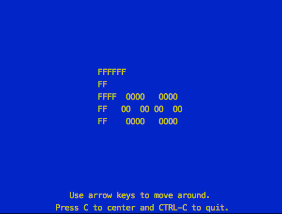

foo-cli
=======

  > My just-for-fun command-line app.

[](https://www.npmjs.com/package/@simbo/foo-cli)
[](https://travis-ci.org/simbo/foo-cli/builds)

---


## About

This is a fun project to explore some terminal features.

It creates a colored, movable *Foo*:



And that's pretty much all it can <strike>do</strike> *show* at the moment.


## Installation

[`@simbo/foo-cli`](https://www.npmjs.com/package/@simbo/foo-cli)
is a public user-scoped npm package.

``` sh
npm install --global @simbo/foo-cli
```


## Usage

Simply run `foo` in your terminal.

``` sh
foo
```


## License

[MIT © 2018 Simon Lepel](http://simbo.mit-license.org/)
